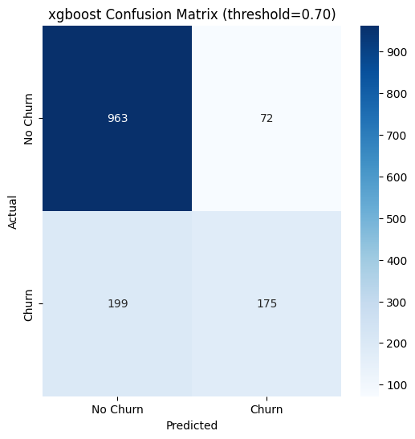

[](https://www.python.org/downloads/release/python/)

# Telecom Churn Prediction Pipeline

## Overview

A modular machine learning pipeline for predicting customer churn using the Kaggle Telco dataset (~7 000 customers, 21 columns).  
The aim is to identify which subscribers are likely to leave and highlight the key factors behind their decisions.

> A business problem tackled through a clean ML structure.

---

## 📁 Project Structure

```
churn/
├── data/
│   ├── telecom_churn.csv
│   └── cleaned_data.csv
│
├── logs/
│   └── pipeline.log
│
├── results/
│   ├── metrics/
│   │   ├── all_metrics.csv
│   │   └── feature_scores.csv
│   ├── predictions/
│   │   ├── decision_tree_predictions.csv
│   │   ├── logistic_regression_predictions.csv
│   │   └── xgboost_predictions.csv
│   └── plots/
│       ├── xgboost_confusion_matrix.png
│       ├── decision_tree_confusion_matrix.png
│       └── logistic_regression_confusion_matrix.png
│
├── src/
│   ├── __init__.py
│   ├── config.py              # Configuration variables (paths, params)
│   ├── utils.py               # Logging setup and helper methods
│   ├── preprocessing.py       # Cleaning, encoding, feature selection
│   ├── training.py            # Trains XGBoost, DecisionTree, LogisticRegression
│   ├── evaluation.py          # Metrics, plots, outputs
│
├── pipeline.py
├── diagram.svg
├── requirements.txt
└── README.md
```

---

## 🔍 Results

| Model               | Accuracy | Precision | Recall | F1‑score | ROC AUC |
|--------------------|----------|-----------|--------|----------|---------|
| Logistic Regression| 0.7913   | 0.6299    | 0.5187 | 0.5689   | 0.7043  |
| XGBoost            | 0.7537   | 0.5252    | 0.7513 | 0.6183   | 0.7529  |
| Decision Tree      | 0.7260   | 0.4853    | 0.5294 | 0.5064   | 0.6633  |

> Logistic Regression is the best all-rounder, but XGBoost performs better in catching potential churners (recall).
> In other words Xgboost catches 3 out of 4 actual churners

---

## ⭐ Key Features Influencing Churn

| Rank | Feature          | Mutual Info |
|------|------------------|-------------|
| 1    | Contract         | 0.0981      |
| 2    | Tenure           | 0.0838      |
| 3    | OnlineSecurity   | 0.0665      |
| 4    | TechSupport      | 0.0659      |
| 5    | OnlineBackup     | 0.0505      |
| 6    | InternetService  | 0.0470      |
| 7    | DeviceProtection | 0.0465      |
| 8    | MonthlyCharges   | 0.0459      |
| 9    | PaymentMethod    | 0.0447      |
| 10   | StreamingMovies  | 0.0418      |

> Here as you can see the most relevant features, or i'd say the features correlated the most to churning

---

## 💡 Why This Matters

Keeping a telecom customer costs less than acquiring a new one.  
This pipeline helps spot high-risk subscribers early and empowers the team to take action — whether it's offering discounts, improving support, or changing plans.

---

## 🛠 How to Run

```bash
git clone https://github.com/Thedarkiin/telecom-project.git
cd churn
pip install -r requirements.txt
python pipeline.py
```

**Outputs generated:**

- `results/metrics/all_metrics.csv`
- `results/metrics/feature_scores.csv`
- `results/metrics/xgboost_confusion_matrix.png`, etc.

---

## 📊 Visuals

### 🔹 Pipeline Architecture


### 🔹 Confusion Matrix – XGBoost




---

## 🚧 Next Steps (hopefully)

- Add SHAP explainability (a method that's based on game theory, and can enhance the model further. Also, it explains why such predictions occured.)  
- turn the project ""model into an API service (if you happen to clone or fork the project so that you can modify it on your own,make sure to save the model using joblib ask an llm for further infos abt this )
- Run the pipeline in a Docker container 

---

## 🤝 Contributing

Contributions are welcome! Please open an issue or pull request to suggest improvements.

---

## 📎 About

Created by [Yassin Asermouh](https://www.linkedin.com/in/yassin-asermouh-984aa8249/).  
Built for learning, experimentation, and going beyond basic jupy notebooks.

**Data**: [Kaggle - Telco Customer Churn](https://www.kaggle.com/datasets/blastchar/telco-customer-churn)
