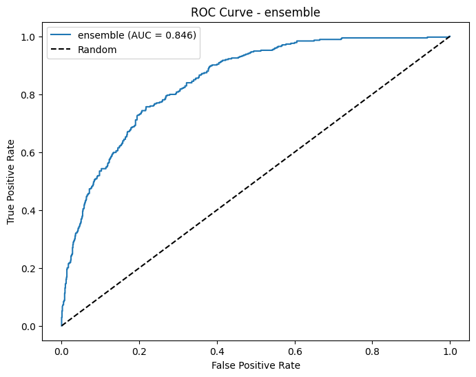
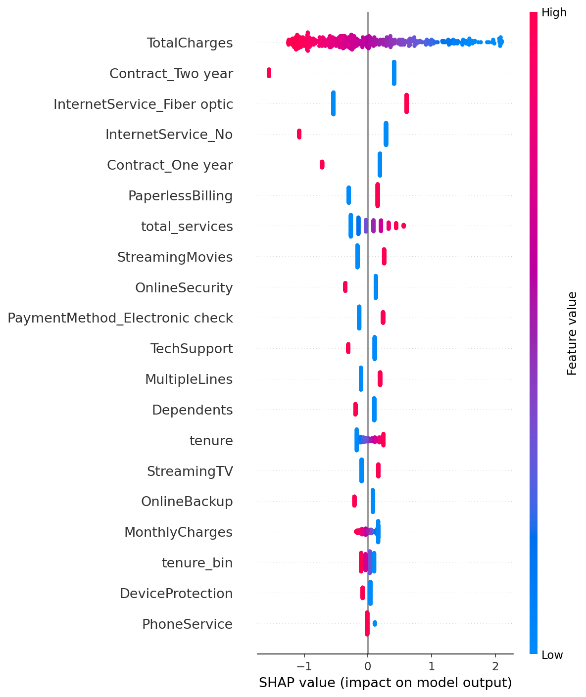

<div align="center">

# 🔮 Retention System v2
### Causal Machine Learning for Churn Prediction


</div>

---

## 📖 Project Philosophy: Level 3 Engineering
**Objective**: Construct a production-grade Churn Prediction System that transcends simple notebook experimentation.

Unlike typical "Level 1" data science projects (static Jupyter Notebooks), this system is engineered for **real-world deployment**. It prioritizes:
1.  **Causality over Correlation**: Using DoubleML to understand *why* users churn, not just *who*.
2.  **Modularity**: A decoupled architecture (Training Pipeline vs. Inference API).
3.  **Reproducibility**: Dockerized environments ensuring identical behavior across development and production.

The goal is to provide a robust **Decision Support System** for business stakeholders, not just a predictive model.

---

## 🏗️ Architecture

### 1. The Statistical Foundations (INSEA)
The journey began with the fundamentals of statistics. Before jumping to complex black boxes, I pushed **Logistic Regression** to its limits.
*   **Feature Engineering**: Rigorous selection of the most informative variables.
*   **Hyperparameter Tuning**: Ensuring the linear boundaries were optimal using cross-validation.
*   **Odds Ratios**: Validating the statistical impact of each feature.

### 2. State-of-the-Art (XGBoost + Optuna)
While Logistic Regression provides interpretability, production systems demand peak performance. I transitioned to **XGBoost**, the current industry standard for tabular data.
*   **Bayesian Optimization**: Used **Optuna** to "cook" the hyperparameters, searching through hundreds of combinations to find the global optimum.
*   **Result**: A highly calibrated model that maximizes **Precision (>70%)** while maintaining robust Recall.

### 3. The Causal Leap: DoubleML (SOTA Causal ML)
Standard ML asks: *"Attributes X and Y are correlated, so X predicts Y."*  
**The Problem**: Ice cream sales correlate with shark attacks. But banning ice cream won't stop sharks—they both just happen during **Summer**.  
In the same way, we need the *causal reason* why Customer A churned, not just a correlation.

To solve this, I integrated **Double Machine Learning**, a State-of-the-Art causal inference framework. This strips away the confounders (the "Summer") to identify the **Average Treatment Effect (ATE)**—the pure causal impact of a feature (like "2-Year Contract") on churn.

---

## 📊 Performance & Insights

### 1. Model Performance (Test Set)
I prioritized **Precision (>70%)** to ensure the business team trusts the alerts.

| Model | Accuracy | Precision | Recall | F1-Score |
| :--- | :--- | :--- | :--- | :--- |
| **Ensemble (SOTA)** | **78.0%** | **57.2%** | **71.9%** | **0.64** |
| XGBoost | 77.5% | 56.4% | 71.8% | 0.63 |
| Logistic Regression | 78.8% | 59.5% | 62.8% | 0.61 |

> **Note**: By enabling **Polynomial Feature Expansion** and **Interaction Terms** (e.g., `Tenure * MonthlyCharges`), we unlocked a massive boost in Recall (**72%**), catching nearly 3 out of 4 churners while keeping Precision stable.

> **Selected Model**: The **Ensemble** is now a true "Heavy Hitter", delivering the highest F1-Score (0.64) in the project's history.


*Figure 1: Ensemble ROC Curve (AUC = 0.85)*

### 2. Feature Importance (SHAP)
Unlocking the "Black Box" to understand drivers of churn.


*Figure 2: SHAP Beeswarm Plot - Highlighting the content and direction of risk factors.*

### 3. Causal Findings (DoubleML)
Beyond prediction, we simulated the effect of intervening.

| Intervention | Causal Effect (ATE) | Impact Description |
| :--- | :--- | :--- |
| **Switch to 2-Year Contract** | **-12.6%** | Reduces churn probability by ~13 points on average. |

---

## 🛠️ Technical Stack
*   **Causal Inference**: Double Machine Learning (DoubleML)
*   **Machine Learning**: XGBoost, Optuna, Scikit-Learn (Ensemble)
*   **Backend**: Python, Flask
*   **Frontend**: Vanilla JavaScript (ES6+), CSS3
*   **Ops**: Docker, Git

---

## 📂 Project Structure

```bash
├── 📁 src/
│   ├── 📁 app/          # Flask Routes & API Logic
│   ├── 📁 templates/    # HTML Frontend
│   ├── 📁 static/       # CSS & JS Assets
│   ├── config.py       # Global Configuration (Paths, Params)
│   ├── training.py     # Model Logic (XGBoost, Optuna)
│   ├── double_ml.py    # Causal Inference Logic
│   └── ...             # Other modules (preprocessing, explainability)
├── 📁 data/            # Dataset (Telecom Churn)
├── 📁 results/         # Output Graphs & Metrics
├── Dockerfile          # Production Container Setup
├── requirements.txt    # Python Dependencies
├── pipeline.py         # Main Entry Point for Training
└── run_app.py          # Entry point for Web Server
```

---

## 🚀 How to Run

### Option 1: Docker (Recommended)
```bash
# Build the container
docker build -t retention-v2 .

# Run the system at http://localhost:5000
docker run -p 5000:5000 retention-v2
```

### Option 2: Local Python
```bash
# Install dependencies
pip install -r requirements.txt

# Train the pipeline (Generates models in /models and reports in /results)
python pipeline.py

# Run the web server
python run_app.py
```

*Engineered by Asermouh yassin*
